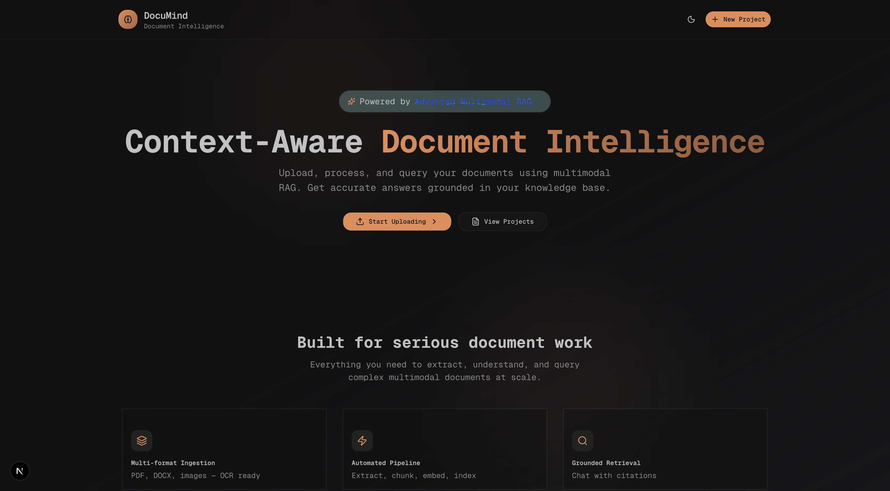
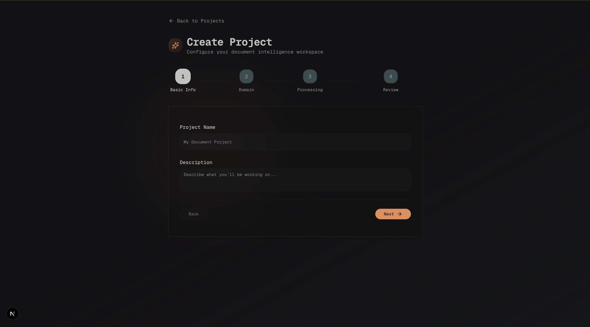
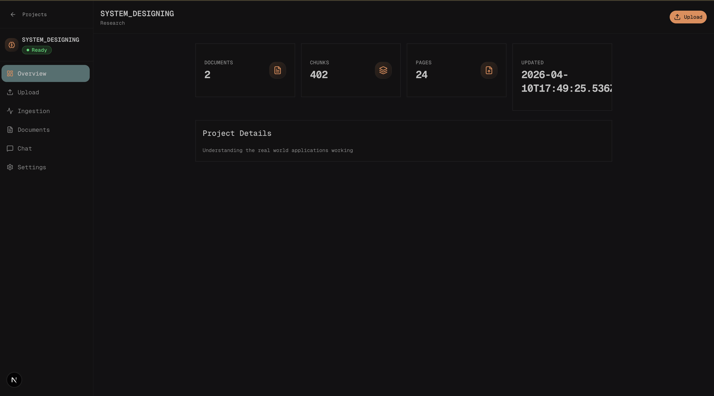
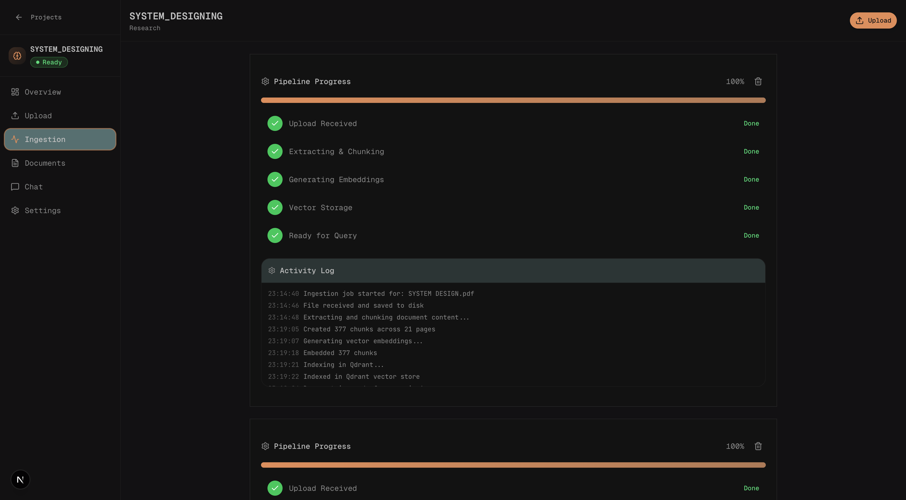
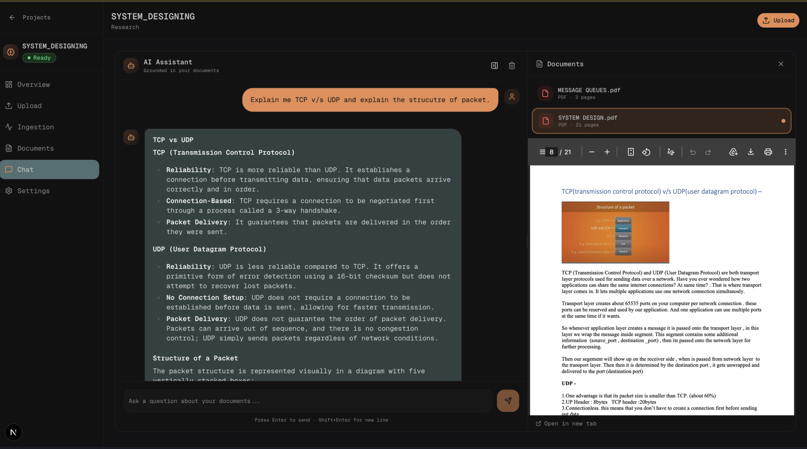

# AI-Powered Document Q&A System

An intelligent document understanding system that extracts text, images, and tables from documents, generates embeddings, and provides AI-powered question-answering capabilities.

## Features

### Document Processing
- **Text Extraction**: Automatically extracts and chunks text content from uploaded documents
- **Image Captioning**: Detects images in documents and generates detailed descriptions using GPT-4
- **Table Understanding**: Identifies tables and generates detailed descriptions of their structure and insights
- **Smart Chunking**: Processes documents into optimized chunks for retrieval

### AI Capabilities
- **Semantic Search**: Find relevant content across all uploaded documents using vector embeddings
- **Context-Aware Q&A**: Get accurate answers grounded in your document content
- **Source Citations**: Every answer includes references to the original source documents
- **Multi-Format Support**: Works with PDFs, text files, CSVs, HTML, and more

### User Interface
- **Modern Chat Interface**: Clean, responsive UI built with React and Tailwind CSS
- **Document Viewer**: Preview uploaded documents directly in the browser
- **Real-time Processing**: Live status updates during document ingestion
- **Dark Mode Support**: Full theming support with next-themes

## Tech Stack

### Frontend
- **Next.js 16** - React framework with App Router
- **React 19** - UI library
- **TypeScript** - Type safety
- **Tailwind CSS v4** - Styling with @tailwindcss/typography plugin
- **shadcn/ui** - UI components built on Radix UI
- **Framer Motion** - Animations
- **React Markdown** - Markdown rendering for AI responses

### Backend
- **FastAPI** - Python REST API
- **LangChain** - RAG orchestration
- **Qdrant** - Vector database for embeddings
- **OpenAI** - GPT-4 for image/table analysis and chat completions
- **Unstructured API** - Document parsing and element extraction
- **Prisma** - Database ORM

## Project Structure

```
COLLEGE_MINI_PROJECT/
├── frontend/                 # Next.js React application
│   ├── app/                  # App Router pages and layouts
│   ├── components/           # React components (ChatPanel, etc.)
│   ├── lib/                  # Utilities and helpers
│   └── types/                # TypeScript type definitions
├── ai-backend/               # FastAPI backend
│   ├── main.py               # API endpoints (upload, chat, delete)
│   ├── ingestion.py          # Document ingestion pipeline
│   ├── chunking.py           # Text chunking and processing
│   └── research_codes/       # Research and utility scripts
└── screenshots/              # Project screenshots
```

## How It Works

### Landing Page
Welcome screen with project overview and quick actions.



### 1. Create Project
Start by creating a new project to organize your documents.



### 2. Upload Documents
Upload your documents (PDF, TXT, CSV, etc.). The file is saved and an ingestion job is created automatically.



### 3. Document Processing Pipeline
Watch real-time processing status as your document goes through the pipeline:

```
upload_received → chunking → embeddings → vector_storage → ready
```



**Chunking Stage:**
- Document sent to Unstructured API for element extraction
- Text elements are split into 2000-character chunks with 200-character overlap
- Images are extracted with captions and analyzed by GPT-4
- Tables are converted to HTML and described by GPT-4

**Embeddings Stage:**
- Each chunk is embedded using OpenAI's text-embedding-3-large model
- Vectors are stored in Qdrant with metadata (filename, page number, type, caption)

### 4. Ask Questions
Chat with your documents using the AI-powered chat interface. Get accurate answers with source citations.



- User query is embedded and matched against vector database
- Top 6 most relevant chunks are retrieved
- GPT-4 generates an answer using only the provided context
- Response includes citations to source documents

## Getting Started

### Prerequisites
- Node.js 18+ and npm
- Python 3.9+
- Qdrant vector database (running on localhost:6333)
- OpenAI API key
- Unstructured API key

### Environment Variables

Create a `.env` file in the root directory:

```env
# OpenAI
OPENAI_API_KEY=your_openai_api_key

# Unstructured API
UNSTRUCTURED_API_KEY=your_unstructured_api_key

# Qdrant
QDRANT_URL=http://localhost:6333

# Next.js
NEXTJS_URL=http://localhost:3000
NEXT_PUBLIC_FASTAPI_URL=http://localhost:8000
```

### Installation

1. **Clone the repository**
```bash
git clone <repository-url>
cd COLLEGE_MINI_PROJECT
```

2. **Install frontend dependencies**
```bash
cd frontend
npm install
```

3. **Set up backend virtual environment**
```bash
cd ai-backend
python -m venv .venv
source .venv/bin/activate  # On Windows: .venv\Scripts\activate
pip install -r requirements.txt
```

4. **Start Qdrant** (if not already running)
```bash
docker run -p 6333:6333 qdrant/qdrant
```

5. **Start the development servers**

Terminal 1 - Backend:
```bash
cd ai-backend
source .venv/bin/activate
uvicorn main:app --reload --port 8000
```

Terminal 2 - Frontend:
```bash
cd frontend
npm run dev
```

6. **Open the application**
Navigate to `http://localhost:3000`

## API Endpoints

| Method | Endpoint | Description |
|--------|----------|-------------|
| POST | `/upload` | Upload a document for processing |
| POST | `/chat` | Send a question and get AI-powered answer |
| GET | `/files/{project_id}/{document_name}` | Serve document files |
| DELETE | `/documents/{document_id}/delete` | Delete document from vector DB |

## Key Components

### `chunking.py`
- `partition_via_api()`: Sends files to Unstructured API for element extraction
- `process_images_with_caption()`: Extracts and describes images using GPT-4
- `process_tables_with_description()`: Analyzes tables and generates insights
- `process_text_chunks()`: Splits text into retrievable chunks

### `ingestion.py`
- `ingest_file_to_vector_db()`: Orchestrates the full ingestion pipeline
- `update_stage()`: Updates job status for real-time frontend feedback
- `store_in_qdrant()`: Stores embedded chunks in vector database

### `main.py` (FastAPI)
- `/upload`: Handles file uploads and triggers background ingestion
- `/chat`: Retrieves relevant context and generates AI responses
- `/files/{project_id}/{document_name}`: Serves uploaded documents

### `ChatPanel.tsx` (Frontend)
- Real-time chat interface with AI assistant
- Document viewer with resizable panels
- Citation display with relevance scores
- Markdown rendering for formatted responses

## License

This project is for educational purposes as part of a college mini-project.
